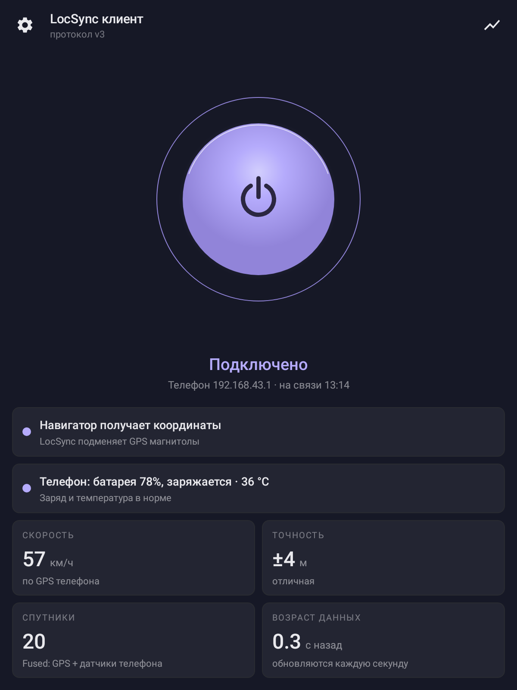
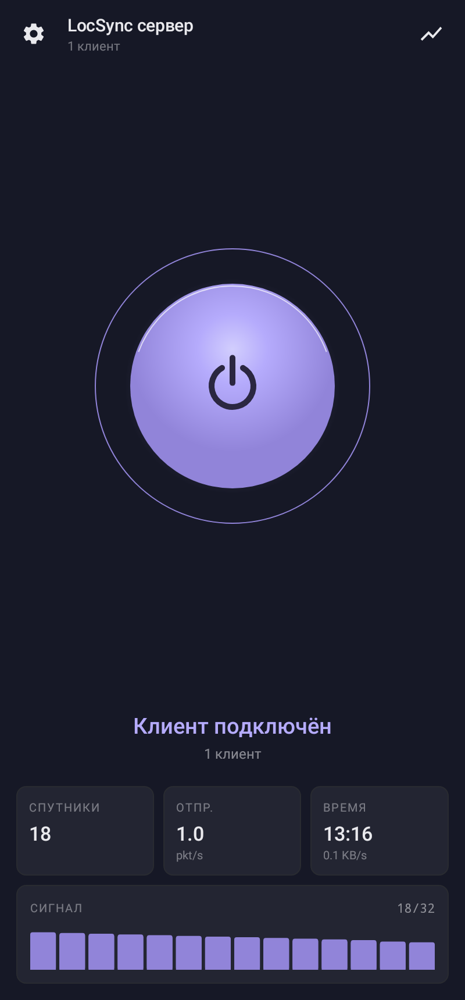
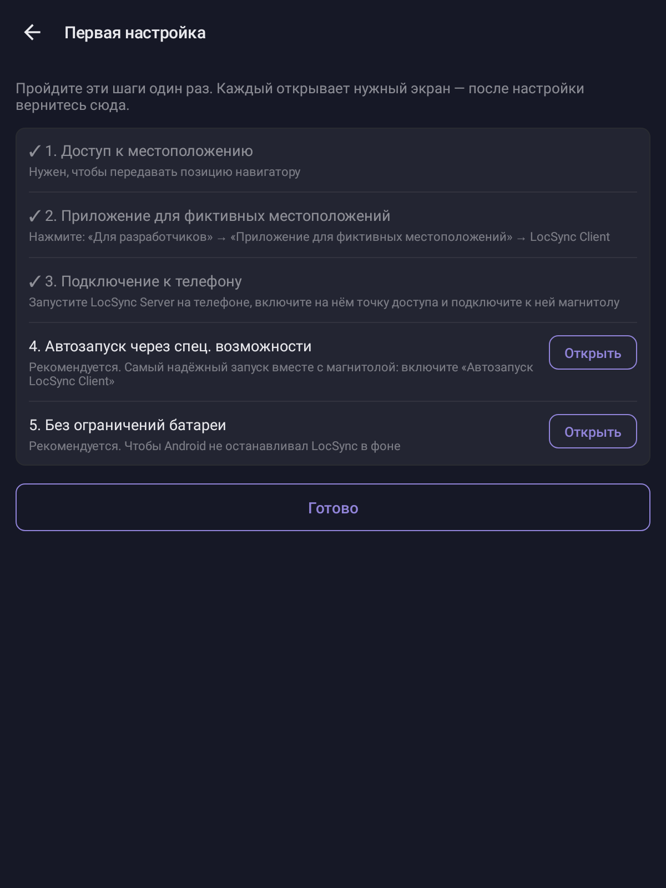
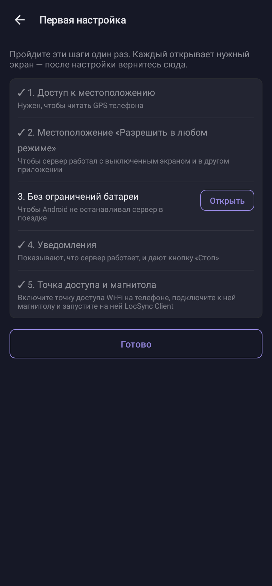
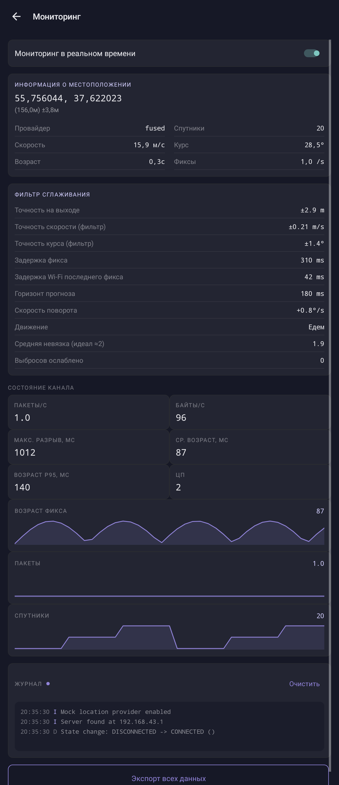
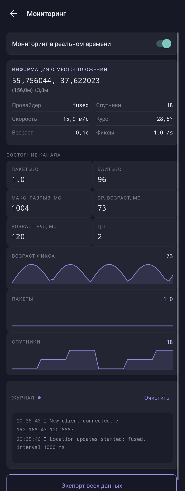
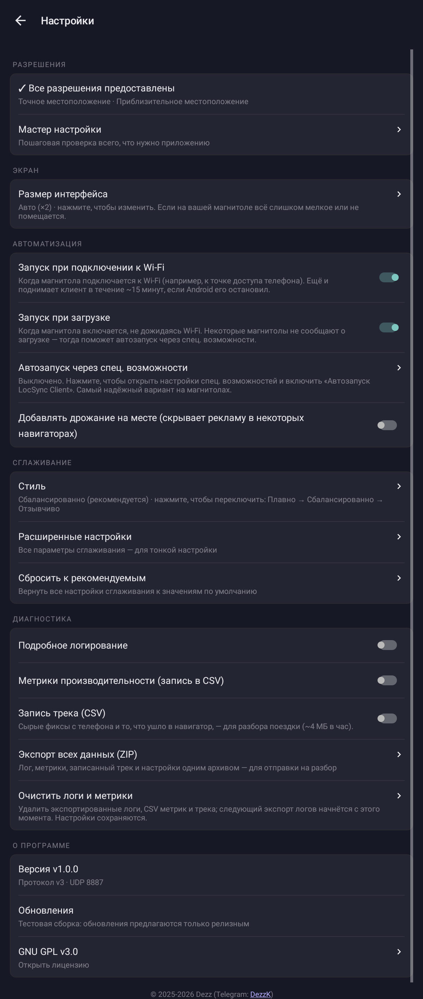
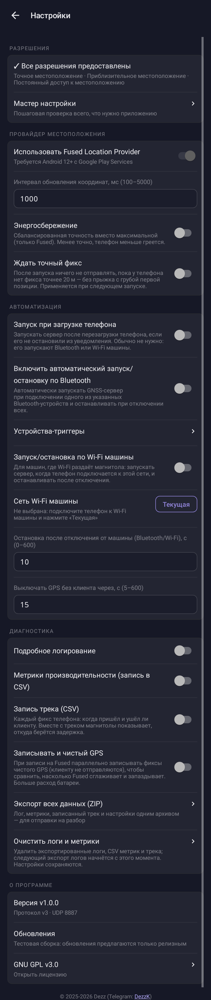

# LocSync

**GPS телефона — в навигаторе магнитолы.**

LocSync передаёт точные координаты с телефона на Android-магнитолу по Wi-Fi.
Навигатор на магнитоле (Яндекс Навигатор, Google Maps, 2ГИС и любые другие)
видит их как собственный GPS: машина на карте двигается плавно, без рывков,
даже если встроенного приёмника в магнитоле нет или он ловит плохо.

  
  &nbsp;&nbsp;
  

Система из двух приложений:

| | Куда ставить | Что делает |
|---|---|---|
| **LocSync Server** | телефон | берёт координаты с GPS телефона и отправляет на магнитолу |
| **LocSync Client** | магнитола | принимает координаты, сглаживает их и подменяет ими GPS магнитолы |

Интернет не нужен — достаточно точки доступа Wi-Fi на телефоне.

## Возможности

- **Без настройки адресов.** Клиент сам находит телефон в сети.
- **Плавное движение.** Фильтр сглаживания выдаёт позицию 10 раз в секунду,
  предсказывает её на поворотах и компенсирует задержку Wi-Fi — значок не
  отстаёт от машины и не «прыгает».
- **Стоит — значит стоит.** На светофоре позиция не «плывёт», и навигатор не
  перестраивает маршрут.
- **Сам запускается.** Клиент стартует при включении магнитолы и подключении к
  Wi-Fi; сервер может запускаться и останавливаться по Bluetooth или Wi-Fi
  машины, а вручную — плиткой в шторке телефона.
- **Бережёт батарею.** Когда магнитола отключается, GPS телефона выключается
  через 15 секунд.
- **Видно, что происходит.** На главном экране — получает ли навигатор
  координаты, скорость, точность, спутники, заряд и температура телефона;
  на экране мониторинга — подробности.
- **Следит за телефоном.** Если телефон в держателе перегревается или садится,
  магнитола предупредит об этом: перегретый телефон хуже ловит GPS.
- **Обновляется из приложения.** Оба приложения раз в день проверяют, вышла ли
  новая версия, и ставят её по нажатию.
- **Подсказывает настройку.** При первом запуске открывается список шагов —
  каждый ведёт на нужный экран системы и отмечается галочкой, когда сделан.

## Требования

- **Телефон:** Android 7.0 или новее. Режим Fused (GPS + датчики телефона,
  точнее и стабильнее) — Android 12+ с сервисами Google Play.
- **Магнитола:** Android 9.0 или новее, с Wi-Fi и доступом к «Параметрам
  разработчика».

## Установка

Скачайте оба APK со страницы [Releases](https://github.com/g00dvin/locsync/releases/latest):

- `locsync-server-vX.Y.Z.apk` — на телефон;
- `locsync-client-vX.Y.Z.apk` — на магнитолу (например, с флешки).

Дальше приложения обновляются сами: раз в день они проверяют страницу релизов
и, если вышла новая версия, показывают это на главном экране и в «Настройки →
О программе → Обновления». Нажмите «Установить» — APK скачается и откроется
установщик Android (в первый раз он попросит разрешить установку из этого
приложения). Обновления ставятся поверх, настройки сохраняются. Версии сервера и
клиента лучше держать одинаковыми: если они несовместимы, клиент об этом сообщит.

## Первая настройка

При первом запуске каждое приложение открывает **список шагов настройки**:
у каждого шага есть кнопка, которая ведёт на нужный экран системы, а сделанные
шаги отмечаются галочкой. Список можно открыть снова в «Настройки →
Разрешения → Мастер настройки». Ниже — то же самое подробно.

  
  &nbsp;&nbsp;
  

### 1. Телефон

1. Откройте **LocSync Server** и выдайте доступ к местоположению — выберите
   **«Разрешить в любом режиме»**, иначе сервер не сможет работать с
   выключенным экраном.
2. Включите **точку доступа Wi-Fi** на телефоне.
3. Нажмите на большой круг — сервер запущен, в шторке появится уведомление.
   Запускать и останавливать сервер можно и плиткой **LocSync** в быстрых
   настройках (добавьте её через редактирование шторки).

### 2. Магнитола

1. Подключите магнитолу к точке доступа телефона.
2. Включите **режим разработчика**: «Настройки» → «О системе» → семь раз
   нажмите на «Номер сборки».
3. «Настройки» → «Для разработчиков» → **«Приложение для фиктивных
   местоположений»** → выберите **LocSync Client**. Без этого шага подменить GPS
   нельзя — клиент напомнит об этом красной карточкой и откроет нужный экран
   по нажатию.
4. Откройте **LocSync Client**, выдайте доступ к местоположению и нажмите на
   круг.

Через пару секунд клиент найдёт телефон, а на главном экране появится
**«Навигатор получает координаты»**. Откройте навигатор — машина должна быть
там, где вы стоите.

### 3. Автозапуск (рекомендуется)

Чтобы ничего не нажимать при каждой поездке:

- **Магнитола.** В настройках клиента есть два отдельных выключателя (оба
  включены по умолчанию): **«Запуск при подключении к Wi-Fi»** и **«Запуск
  при загрузке»**. Запуск срабатывает, только если клиент хотя бы раз
  запускали кругом. На многих магнитолах надёжнее работает **«Автозапуск через спец.
  возможности»**: нажмите на пункт и включите «Автозапуск LocSync Client» в
  системных настройках специальных возможностей. Клиент ничего не читает с
  экрана — система просто не даёт ему выгружаться и запускает при включении.
- **Телефон.** В настройках сервера включите «Автоматический запуск/остановку
  по Bluetooth» и выберите в «Устройствах-триггерах» Bluetooth машины. Сервер
  будет стартовать, когда телефон подключается к машине, и останавливаться
  после отключения.
- **Если Wi-Fi раздаёт магнитола**, а телефон к ней подключается: включите
  «Запуск/остановка по Wi-Fi машины», подключите телефон к Wi-Fi магнитолы и
  нажмите «Текущая» в пункте «Сеть Wi-Fi машины». Для этого телефону нужен доступ
  к местоположению «Разрешить в любом режиме» — без него Android скрывает имя
  сети от приложений в фоне.

Точку доступа на телефоне многие прошивки умеют включать автоматически при
подключении к Bluetooth машины — это настраивается в самом телефоне.

## Экраны

### Главный экран

  
  &nbsp;&nbsp;
  

Круг — запуск и остановка. Под ним — состояние связи.

**Клиент.** Карточка отвечает на главный вопрос — получает ли навигатор
координаты:

| Карточка | Что значит |
|---|---|
| Навигатор получает координаты | всё работает |
| Ищем телефон | сервер не найден: запущен ли он и подключена ли магнитола к точке доступа телефона |
| Нет свежих координат | телефон на связи, но не присылает позицию — проверьте GPS на телефоне |
| Подмена GPS не настроена | не выбрано приложение для фиктивных местоположений (шаг 3 настройки) |

Ниже — карточка **телефона**: заряд, зарядка и температура. Она становится
красной, если телефон перегревается (Android начинает ограничивать GPS) или
заряда меньше 15% без зарядки.

Плитки: **скорость**, **точность** (радиус, в котором машина находится с
вероятностью 68%; до 5 м — отлично), **спутники** и **возраст данных** — сколько
секунд назад телефон определил позицию.

**Сервер.** Число спутников, скорость отправки пакетов, время на связи и
уровень сигнала спутников, по которым телефон определяет позицию.

### Мониторинг

  
  &nbsp;&nbsp;
  

Значок графика справа вверху. Координаты, состояние фильтра сглаживания (на
клиенте), качество канала связи, графики и журнал событий. Обновление в
реальном времени включается переключателем вверху — по умолчанию оно выключено,
чтобы не тратить ресурсы.

### Настройки

  
  &nbsp;&nbsp;
  

Значок шестерёнки слева вверху. Значения по умолчанию подобраны по реальным
поездкам — менять их не обязательно. У каждого пункта есть пояснение.

**Сервер (телефон):**

- **Fused Location Provider** — GPS вместе с датчиками телефона: точнее и
  стабильнее, чем чистый GPS. Выключите, если на телефоне нет сервисов Google.
- **Интервал обновления** — как часто телефон определяет позицию (по умолчанию
  1 с). Некоторые телефоны умеют чаще.
- **Энергосбережение** — меньше нагрев и расход батареи ценой точности.
- **Ждать точный фикс** — не отправлять ничего, пока первая позиция не станет
  точнее 20 м.
- **Автоматизация** — запуск и остановка по Bluetooth или Wi-Fi машины,
  задержка остановки, через сколько выключать GPS без клиента.

**Клиент (магнитола):**

- **Экран** — **размер интерфейса**: «Авто» или ×1…×3, если на вашей
  магнитоле всё слишком мелкое или не помещается.
- **Автоматизация** — автозапуск и **дрожание на месте**: некоторые навигаторы
  показывают рекламу, пока машина стоит; лёгкое дрожание позиции её скрывает.
- **Сглаживание** — **стиль**: «Плавно», «Сбалансированно» (рекомендуется) или
  «Отзывчиво». Если значок на поворотах запаздывает — выберите «Отзывчиво»;
  если дёргается на прямой — «Плавно». Все параметры фильтра собраны в
  «Расширенных настройках», а «Сбросить к рекомендуемым» вернёт значения по
  умолчанию.

**Диагностика** (в обоих приложениях) — подробный журнал, метрики, запись трека
поездки и **«Экспорт всех данных (ZIP)»**: один архив с журналом, метриками,
треком и настройками, который удобно приложить к сообщению о проблеме.
«Очистить логи и метрики» удаляет накопленные файлы, не трогая настройки.

## Частые проблемы

**Клиент пишет «Ищем телефон».**
Проверьте, что сервер запущен (есть уведомление на телефоне) и магнитола
подключена именно к точке доступа телефона. Некоторые телефоны изолируют
клиентов точки доступа — тогда помогает выключить и включить хотспот.

**«Нет свежих координат».**
Телефон не может определить позицию: проверьте, что включена геолокация, и что
телефон не лежит там, где плохо видно небо (например, в бардачке).

**Навигатор показывает старое место или не двигается.**
Убедитесь, что LocSync Client выбран в «Приложении для фиктивных
местоположений», а встроенный GPS магнитолы не перебивает его (в некоторых
навигаторах источник позиции выбирается в настройках).

**Сервер останавливается сам.**
Отключите оптимизацию батареи для LocSync Server в настройках телефона
(«Батарея» → «Без ограничений»). На Xiaomi, Huawei, Samsung также разрешите
автозапуск и работу в фоне.

**Телефон перегревается.**
Карточка телефона на магнитоле стала красной: уберите телефон с солнца или
из-под обдува печки. Перегретый телефон ограничивает GPS, и позиция начинает
отставать или пропадает.

**Интерфейс клиента слишком мелкий или не помещается.**
«Настройки → Экран → Размер интерфейса» — нажимайте, пока размер не подойдёт.

**После перезагрузки магнитолы клиент не запускается.**
Включите «Автозапуск через спец. возможности» — это самый надёжный способ на
магнитолах.

Если проблема не ушла — сделайте «Экспорт всех данных (ZIP)» в настройках
обоих приложений и приложите архивы к
[issue](https://github.com/g00dvin/locsync/issues).

## Для разработчиков

Устройство системы, протокол, сборка и выпуск релизов — в
[docs/DEVELOPMENT.md](docs/DEVELOPMENT.md).

## Лицензия

[GNU General Public License v3.0](LICENSE).
